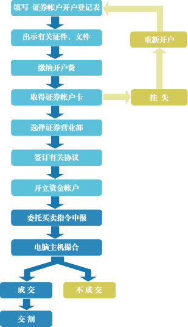
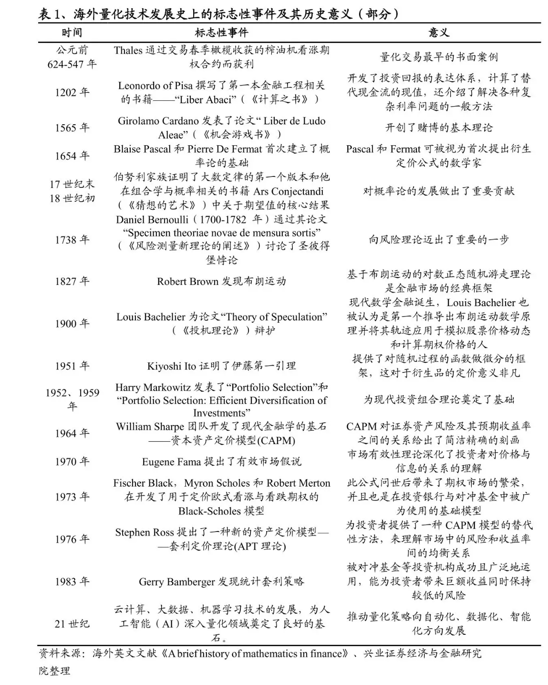
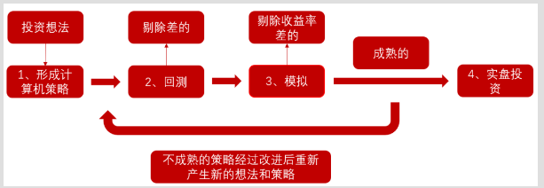

# 01_投资与量化投资

目录

1.1 什么是投资

1.2 股票投资的基本流程

1.3 常见的股票投资分析流派

1.4 什么是量化投资

1.5 量化投资的历史发展

1.6 量化投资的一般流程

1.7 常见的量化投资平台

## 1.1 什么是投资

### 经济意义上的投资

> 在社会生活中，投资一词是人们经常遇到和使用到的，如**固定资产投资，证券投资，教育投资，健康投资，乃至感情投资**等等。这些概念有的属于经济学意义上的投资，有的则只是在用语上借用了“投资”概念。从经济学的广泛意义上讲，**投资是为获得一定的预期社会经济效益而进行的资金或资本物的投入及其活动过程**，换句话说，投资是包括政府、金融机构、企业和个人在内的各类经济主体为获得未来收益或效益为目的，预先垫付一定量的货币或实物以经营某项事业的行为活动。

### 投资的分类

1. **实物投资或实物资产投资**
   
  - 实物资产，又称实质资产或有形资产，是以实物形态存在的资产，如汽车、房屋、机器设备、各种原料、材料等，是固定资产与流动资产、生产流通性固定资产与非生产流通性（消费性）固定资产的统一。
  - 实物投资，指投资者将资金用于实物生产即用于购置和建造固定资产和流动资产并以此获得未来收益的行为。
  
  
2. **金融投资或金融资产投资**

  - 金融资产，又称无形资产，是以价值形态存在的资产，如银行储蓄存款、银行贷款、投资基金、股票、债券等。
  - 金融投资，指投资者将资金用于金融资产即用于存款、贷款，或购买股票、债券、基金等各种有价证券，以期获得未来价值增值收益的行为。

### 金融投资

> 金融投资是一个商品经济的概念，它是在资本主义经济的发展过程中，随着投资概念的不断丰富和发展，在实物投资的基础上形成的，并逐步成为比实物投资更受人们关注和重视的投资行为。

> 在资本主义发展初期，资本所有者与资本运用者是结合在一起的，经济主体一般都直接拥有生产资料和资本，亲自从事生产消费，投资大多采取直接投资的方式，也就是直接投入资本，建造厂房，购置设备，购入原材料，从事生产、流通活动，因此，早期的投资概念主要是指实物投资。

> 随着资本主义生产力和商品经济的发展，占有资本和运用资本的分离，日益成为资本运用的一种重要形式。这是因为，随着商品经济的发展，资本主义投资规模不断扩大，单个资本家的资本实力越来越难以满足日益扩大的投资规模对庞大资本的需求，迫切需要超出自身资本范围从社会筹集投资资金，于是，银行信用制度得到了迅速的发展，股份制经济也应运而生，银行信贷、发行股票、债券日益成为投资资金的重要来源。因此，金融投资也成为现代投资概念的重要组成部分。而且，由于现代金融市场的日益发展和不断完善，金融投资的重要性日益凸显，因此，现代投资概念更主要地是指金融投资。在西方学术界的投资学著作中，投资实际上指的就是金融投资，特别是证券投资。  

> 投资是个人或机构期望在未来获得收益或利润，而进行的投入资源的行为。投资可以发生在很多领域。对于个人来说，更多的是金融投资。投资的风险与利益并存，有可能产生资产减值、时间浪费等损失。
- 金融领域：把钱投入具有增长潜力的标的，并期望在未来获得收益。
- 经济领域：现阶段投入资本，并期望获得未来的生产能力。
- 学习领域：你期望提升自己在某个领域的能力，就要投入时间、精力甚至是金钱去学习。

### 个人投资者投资品种
- 股票投资：包括A股、港股、美股等，是高风险高收益的投资品类。投资者选股并买入股票后，如果股价上涨，投资者就获益，如果股价下跌，投资者就遭受损失。
- 基金投资：主要指的是证券投资基金。与股票相比，基金投资不需要选股，相对更为省心。
- 债券投资：包括国债、金融债券、公司债券等。相对股票、基金投资来说，债券投资风险较低，同时收益也较低。
- 房地产投资：在自住之外，再购入多套房，就属于房地产投资。房地产投资金额一般较大，如果房价上涨获利比较可观。但变现期较长，且存在政策调控带来的房价下跌的风险。

### 投资VS投机
- 投资基于基本面分析，注重长期价值。投机基于消息经验，在意短期波动。
- 投资讲究谋定而后动，追求大概率安全。投机是刀尖上跳舞，追求短期内快速增值。

## 1.2 股票投资的基本流程

股票交易流程大差不差，大多数朋友应该都是做A股，此处抛砖引玉

以深交所为例，详细文档参见：
- https://investor.szse.cn/institute/bookshelf/manualseriesbook/P020190322685818724112.pdf
- https://v.icbc.com.cn/userfiles/Resources/ICBC/haiwai/Asia/download/CN/2020/mobilebanking_cashact_cn_may2020v1.pdf

### 1.3 常见的股票投资分析流派

在股票市场上，投资的流派更是百花齐放，既有严谨的基本面分析，也有神秘的技术面分析，甚至有人用风水来预测市场。这些互相看不上对方的流派完全有可能一起赚钱，当然也有可能一起亏钱。也就是说投资和江湖上的武功一样，没有对错优劣，只有适合不适合。在讲解我们的投资方法之前，我们有必要先来了解一下市场上主要的一些投资流派。类似江湖武林，A股市场也有不同的投资门派和流派。首先，根据投资者不同的关注点，赚上市公司盈利的钱和赚市场（别的投资者）的钱，可分为“价值派”与“市场派”两大流派。

### 投资者分析流派

1.宏观策略分析法

> 从宏观经济变化的大方向入手，然后再应用到具体的股票投资中，所以也叫**自上而下**的研究方法。具体来说就是先看当前经济下是否应该投资股票，然后了解到市场中期和长期的趋势，并理解影响这个趋势的核心驱动因素有哪些，然后在这趋势背景下选择哪种风格、主题、行业，甚至选择哪种投资组合。

特点：更多是对市场整体和背景上的“面”的研究，然后选择出最合理的方向。**专业机构做股票投资时，这是运用得最多的方法之一**。

2.价值投资法

> 这种也叫**自下而上**的研究方法，简单说就是选股，选出有巨大增值潜力的股票。发现好的公司后，长期持有，不用过多理会市场短期的波动，伴随公司一起成长，获得长期收益。像巴菲特、格雷厄姆、彼得·林奇和费雪等投资大师，都是这种方法的代表人物。但这种直接自下而上的投资方法，需要对行业发展等有较深的理解，知道具体行业的规模及市场蛋糕未来会有多大，行业有啥特点，竞争格局会如何演变，公司自身的核心竞争力和护城河怎样，业务、产品、盈利、品牌等如何，甚至还要剖析公司的各种财务数据，透过数据看到真实的公司样貌，并看到未来几年后的样子。

3.主题事件投资法

> 这是对某一事件发展趋势进行判断，通过寻找超预期或者制造预期，来找出具有相同属性特征股票的投资机会。整体可分为**体系性主题和事件性主题**两类。
- 体系性主题：关注宏观因素对具体股票的影响，比如说过去几年央行经常放水，就有了降息受益主题。
- 事件性主题：某某新闻，利好的事件、公司危机的事件等等都会在股价中得到反映。例如AIGC、ChatGPT股等。

4.技术分析法

> 散户常用。主要是以股价为研究对象，从股价变化的历史走势着手，看K线、看指标、看图形，对未来价格趋势的变化进行预测。像道氏理论、杰西和索罗斯的心理分析理论、江恩理论等都属于技术分析流。技术分析一般有三类方法，一是看指标，二是画切线，三是研究K线图。

5.量化投资法

> 量化投资其实就是定量投资，是通过数量化和计算机程序化的方式来进行买卖的，通过分析一定的数据，在合理逻辑的支撑下，运用某种策略来投资获得收益目前，量化投资方法在基金行业占比不高，2014年后才逐渐兴起。

## 1.4 什么是量化投资

### 1.4.1量化投资基本概念
量化投资不是一种金融产品品类，而是一种投资交易策略。量化投资策略是利用统计学、数学、信息技术、人工智能等方法取代人工作出决策，通过模型完成股票交易来构建投资组合。利用计算机技术和数学模型去实现投资策略的过程。
一般情况下，市场研究、基本面分析、选股、择时、下单等都可以由计算机自动完成。广义上可以认为，凡是借助于数学模型和计算机实现的投资方法都可以称为量化投资。当前A股市场中，国内比较常见的量化投资方法主要是多因子策略、套利策略和期货CTA策略。
相较于主观投资，量化投资策略的最大特点是其具有一套基于数据的完整交易规则。在投资决策的所有环节，始终贯穿一套完全客观的量化标准，比如，A股票的横指标达到多少的阈值时，才可以开仓，每次开仓要买多少手等交易规则。

**主观投资VS量化投资**

   
|      主观投资      |       量化投资      |
|:------------------:|:--------------------:|
| 基于基金经理的主观判断 | 基于模型运算的客观结果 |
| 基金经理对宏观环境、行业、公司的研究，预测未来的走势 | 核心在于利用计算机技术从海量数据中挖掘投资规律 |
| 更注重研究深度，对少数股票进行深度研究 | 更注重研究广度，全市场筛选标的，多维度分析 |
| 持股集中，投资稳定性略差 | 持股分散，组合投资 |
| 交易依靠主观认知与判断，无法批量复制 | 模型运算自动下单，交易具备纪律性 |

### 1.4.2 量化投资的优势

量化投资的优势表现在以下三方面：

1. 投资范围更广泛：借助计算机技术，信息搜集更具速度和广度，分析范围覆盖整个市场，促进获得更多投资机会。

2. 程序化交易，避免主观因素：通过回测证实或证伪策略的有效性，程序化交易自动下单，克服人性弱点，避免人为情绪等主观因素的干扰。

3. 数据处理快速响应，创造交易价值：采用计算机自动分析，响应速度迅速，拥有强大的数据处理和信息挖掘能力，支撑高频交易，并验证每个决策背后的模型有效性，更有可能创造有效的交易价值。

### 1.4.3 量化投资的主要风险
1. 策略失效风险：量化投资最大的风险是策略失效。但更困难的挑战在于无法预测策略什么时间会失效，而策略失效的损失会非常大。

2. 流通性风险：流通性风险主要是指市场融资风险，不是传统意义上的流通性风险。而是基于很多量化投资基金的策略很像，当许多基金都采用相似的策略，一旦出现比如大的对冲基金需要清仓，卖掉过去盈利的股票，那其他基金就可能输钱甚至被迫平仓，这就会导致有流通性风险的问题。量化投资很多因素导致很容易同质化，带来的问题就是会产生共振，更容易产生系统性的风险。

3. 模型本身的风险：量化投资需要借助模型，而建立模型需要设定各种参数，但是，这些参数很难精准估计。估计不准的时候可能会带来巨大的损失。

### 1.4.4 量化投资出现的主要原因

1.现代金融理论的发展，使得金融定价模型更加科学和精确，例如CAPM模型和马科维茨模型，这些模型可以快速地估算股票的预期收益率和选择最优投资组合。

2.计算机技术的发展，使得量化投资策略的研究和实现更加便捷，例如利用机器学习和人工智能来构建模型和执行交易。

3.交易成本的下降，也使得高频交易变得更加可行，同时也让个人投资者可以通过互联网等渠道低成本地进行投资，促进了量化投资的普及和发展。

## 1.5 量化投资的历史发展

- 量化投资的历史发展始于60年代的美国，起源于赌场中的技术，由爱德华·索普创立，后发展为科学股票市场系统，成立了普林斯顿-纽波特基金。
- 70-80年代是量化投资技术的迭代和理论的发展时期，著名的量化基金公司有Renaissance Technology和D.E. Shaw。
- 90年代是量化投资发展的黄金期，量化投资应用于市场中的各种投资工具，各大理论全面发展。著名的资产资本定价模、市场有效性理论、期权定价理论、套利理论也在这一时间产生，这些理论为量化投资策略成为系统有效的策略奠定了科学理论基础。
- 虽然量化投资在2008年美国金融危机时受到影响，但之后仍然成为市场的主流，并且因为其收益稳定风险较低而普遍受到市场的推崇。

详细查看：https://www.baogaoting.com/info/90450

## 1.6 量化投资的一般流程

量化投资的一般流程包括以下几个步骤：

- 策略设计：基于金融理论、历史数据或其他分析方法，构建量化投资策略的想法。

- 回测验证：使用历史数据对策略进行回测，检验策略的有效性和可行性，以及找到优化策略的方法。

- 模拟盘验证：使用虚拟账户和资金进行模拟交易，检验策略在实际市场中的表现，调整和优化策略。

- 实盘交易：经过前面的验证和优化后，将策略投入实际交易中执行。

需要注意的是，量化投资的策略设计和实施过程需要严谨、科学、系统化的方法，同时也需要一定的技术和数学功底。成功的量化投资不仅仅依赖于策略的设计，也需要严格的风险控制和资金管理。

## 1.7 常见的量化投资平台

### 平台信息

| 平台名称          | 数据方面                                                     | 研究方面                                                     | 回测方面                                                     | 模拟交易方面                                                 | 实盘交易方面                                                 | 交流社区方面                 |
| ----------------- | ------------------------------------------------------------ | ------------------------------------------------------------ | ------------------------------------------------------------ | ------------------------------------------------------------ | ------------------------------------------------------------ | ---------------------------- |
| [聚宽（JoinQuant）](https://www.joinquant.com/study) | 提供2005年至今完整的股市Leve1数据、上市公司财务数据、完整的停复权信息。实时更新行情数据，盘后更新财务数据。此外还提供基金（包括ETF、LOF、分级A/B基金、货币基金）的行情和净值数据，金融期货数据、股票指数数据、行业板块数据、概念板块数据、宏观数据、行情数据等。 | 提供基于IPython Notebook的研究平台，支持Tick级数据，支持Python2、Python3。提供API（Application Programming Interface）。 | 支持股票、基金、期货等品种的回测，支持日、分钟、Tick级回测。 | 支持股票、股指期货、商品期货、ETF等品种的日、分钟、Tick级别的模拟交易。 | 和第一创业合作，支持股票、场内基金、期货的自动化实盘交易。   | “聚宽社区”，活跃度很高。     |
| [掘金（Myquant）](https://www.myquant.cn/) | 提供近10年日/分钟/Tick级别股票数据，及财务、分红送配、行业、板块等数据。还提供股指期货、商品期货的连续数据。 | 支持Python，Matlab，C，C++，C#语言。提供API。                | 支持股票、期货等品种回测及其混合回测，支持日、分钟、Tick级回测。 | 支持股票、商品期货、股指期货等品种的日、分钟级别的模拟交易。 | 需要客户申请和人工审核，具有实盘交易权限后可以手动交易。     | “掘金量化社区”，活跃度较高。 |
| [Bigquant](https://bigquant.com/) | 提供日/分钟级别的股票、期货、基金等数据的实时和历史数据，以及新闻、社交等新型数据。 | 支持Python，提供AI开发策略。提供API。                        | 支持股票、期货等品种的回测，支持日、分钟、Tick级回测。       | 支持日、分钟级别的股票、期货等品种的模拟交易。               | 可推送秒级交易信号，提供API接口对接交易终端，由用户手动交易。 | “Bigquant量化社区”，活跃度较高       |
| [米筐（Ricequant）](https://www.ricequant.com/welcome/) | 提供股票、ETF、期货（股指、国债、商品期货）、现货的基本信息。股票、ETF过去10多年以来每日市场数据，股票、ETF在2005年以来的分钟线数据。ETF过去20多年以来的市场数据和财务数据。期货从1999年以来的每日行情数据。期货2010年以来的分钟线数据。中国50 ETF、商品期权的日、分钟数据。舆情大数据。 | 提供基于IPython Notebook的研究平台，支持Python，Matlab，Excel。提供API。 | 支持股票、ETF、期货等品种的回测，支持日、分钟级回测。 | 支持日、分钟级别的股票、ETF、期货等品种的模拟交易。 | 提供期货的实盘交易。 | “米筐量化社区”，活跃度较高。 |
| [真格量化](https://quant.pobo.net.cn/login#/) | 主要是商品期货、期货期权、金融期货、股票期权等金融衍生品的数据。 | 支持使用Python进行策略研究。提供API。 | 主要提供期货、期权的日、分钟、Tick级别的回测。 | 使用第三方模拟交易平台，主要提供期货、期权的日级别的回测。 | 主要提供期货的实盘交易。 | “真格量化社区”，活跃度一般。 |

### 其它

[天勤量化](https://www.shinnytech.com/tianqin/)

[幻方量化](https://www.high-flyer.cn/hfai_start/)

## 参考
- https://www.joinquant.com/view/community/detail/7e4989804f4d3cd12532cafefeea1bcb
- https://www.econ.sdu.edu.cn/jrtzx/wljc/dl_jrtzyjrtzx.htm
- https://www.futunn.com/learn
- https://www.zhihu.com/question/38311854
- http://www.hlzq.com/main/zcgl/article.shtml?article_id=10,000,392&catalogId=2930
- https://bigquant.com/wiki/doc/fazhanshi-xiang-kexue-MIXe2BMYsA
- https://zhuanlan.zhihu.com/p/443296363
- https://zhouchenlin.github.io/%E9%87%8F%E5%8C%96%E6%8A%95%E8%B5%84%E2%80%94%E2%80%94%E7%AD%96%E7%95%A5%E4%B8%8E%E6%8A%80%E6%9C%AF.pdf
- http://www.dyhjw.com/detail/195055.html
- https://www.zhihu.com/question/276340822
